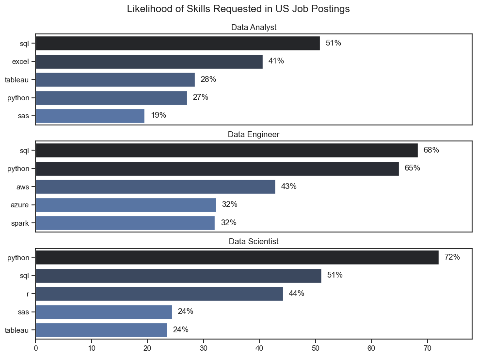

# The Analysis

Welcome to my analysis of the data job market, focusing on data analyst roles. This project was created out of a desire to navigate and understand the job market more effectively. It delves into the top-paying and in-demand skills to help find optimal job opportunities for data analysts.

The data sourced from Luke Barousse's Python Course which provides a foundation for my analysis, containing detailed information on job titles, salaries, locations, and essential skills. Through a series of Python scripts, I explore key questions such as the most demanded skills, salary trends, and the intersection of demand and salary in data analytics.

# The Questions

## 1. What are the most demanded skills for the top 3 most popular data roles?

To find the most demanded skills for the top 3 most popular data roles. I filtered out those positions by which ones were the most popular, and got the top 5 skills for these top 3 roles. This query highlights the most popular job titles and their top skills, showing which skills I should pay attention to depending on the role I'm targeting.

View my notebook with detailed steps here: [Skills_Counts.ipynb](03 Project\Skills_Counts.ipynb)

## Visualize Data

```python

fig, ax = plt.subplots(len(job_titles), 1, figsize=(10, 2.5*len(job_titles)))

sns.set_theme(style='ticks')

for i, job_title in enumerate(job_titles):
    df_plot = df_skills_perc[df_skills_perc['job_title_short'] == job_title].head(5)
    sns.barplot(data=df_plot, x='skill_percent', y='job_skills', ax=ax[i], hue='skill_count', palette='dark:b_r')
    ax[i].set_title(job_title)
    ax[i].set_ylabel('')
    ax[i].set_xlabel('')
    ax[i].get_legend().remove()
    ax[i].set_xlim(0, 78)
    # remove the x-axis tick labels for better readability
    if i != len(job_titles) - 1:
        ax[i].set_xticks([]) #deletes x axis ticks

    # label the percentage on the bars
    for n, v in enumerate(df_plot['skill_percent']):
        ax[i].text(v + 1, n, f'{v:.0f}%', va='center') # va 0 center makes the value appear in the center of the bar.
                 # +1 add a small offset to the x position for better visibility
fig.suptitle('Likelihood of Skills Requested in US Job Postings', fontsize=15)
fig.tight_layout(h_pad=.8) # fix the overlap
plt.show()
```

### Results



### Insights

- SQL is the most requested skill for Data Analysts and Data Scientists, with it in over half the job postings for both roles. For Data Engineers, Python is the most sought-after skill, appearing in 68% of job postings.
- Data Engineers require more specialized technical skills (AWS, Azure, Spark) compared to Data Analysts and Data Scientists who are expected to be proficient in more general data management and analysis tools (Excel, Tableau).
- Python is a versatile skill, highly demanded across all three roles, but most prominently for Data Scientists (72%) and Data Engineers (65%).


